# React Nasa API : Assignment2
## Continuation of Assignment1: Nasa Api APOD Spring API Project

This project serves as a continuation of Assignment1: Nasa Api APOD Spring API Project. The backend API project can be found in the [WE_Assignment1](https://github.com/komalivikas/WE_Assignment1) repository, specifically in the `src/main/java` folder. The React frontend project (Assignment2) is located in the [WE_Assignment1](https://github.com/komalivikas/WE_Assignment1) repository specifically in `WE_Assignment1/NasaFrontEnd` folder.

# NASA Image Viewer App

This is a React application that allows users to explore NASA's Astronomy Picture of the Day (APOD) images. The app provides features such as selecting a specific date, choosing a date range, and fetching images based on the count.

## Features

- Select a specific date to view the APOD image for that day.
- Choose a date range to fetch APOD images within that period.
- Fetch a specific number of APOD images.
- Clear inputs and get feedback when inputs are cleared.
- Validate selected date to ensure it's today's date or a previous date.

**Displayed Items:**
- Title
- Date
- Description
- Image

## Table of Contents

- Installation
- Usage
- Routes
- Features

## Installation

1. Clone the repository:

   ```bash
   git clone https://github.com/komalivikas/WebEng_Assignment1_Nasa.git

2. Install dependencies:

	npm install

 	Run the application:

	npm start

The app will be accessible at http://localhost:3000/new-page.

3. Usage:

This React app provides a user interface to interact with the NASA API by communicating with a Spring Boot backend. It includes the following features:

- Access the app at http://localhost:3000/new-page.

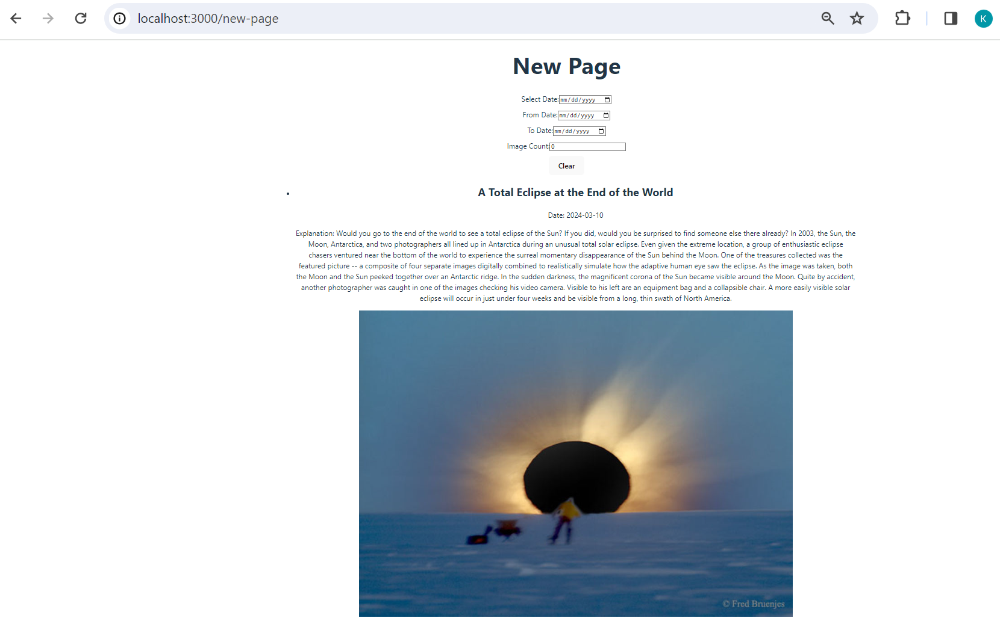


- Select a date to fetch the NASA Astronomy Picture of the Day (APOD).

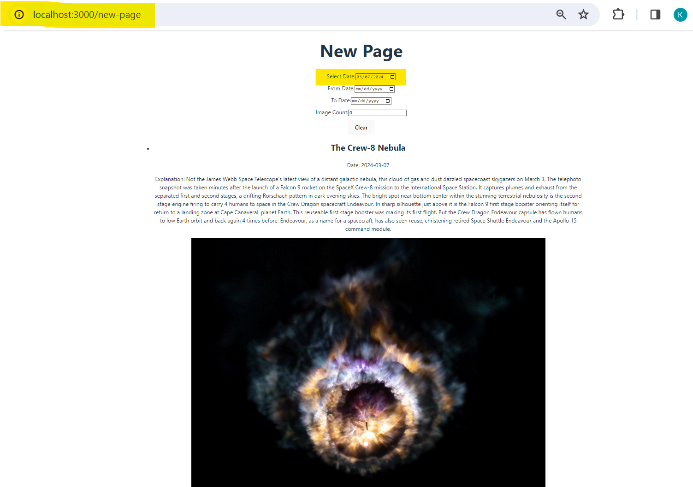


- Specify a date range (from and to dates) to fetch images between certain dates.

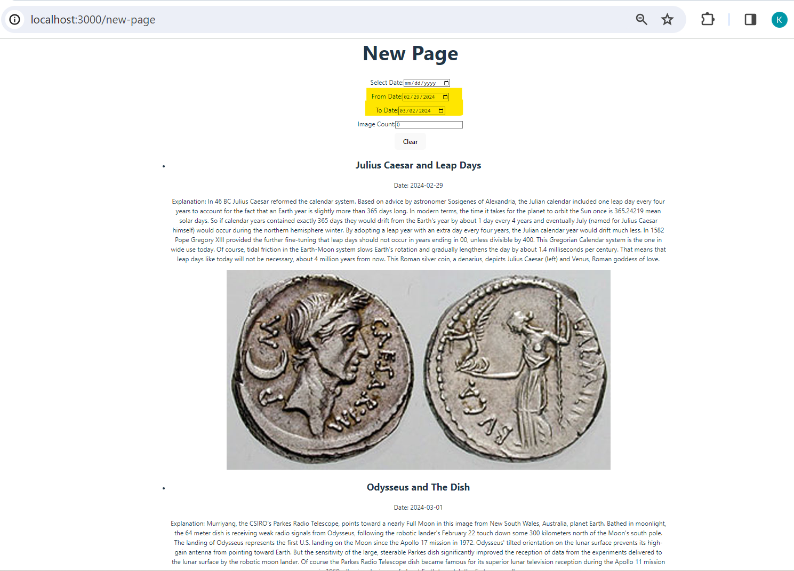


- Input the count of images to retrieve.

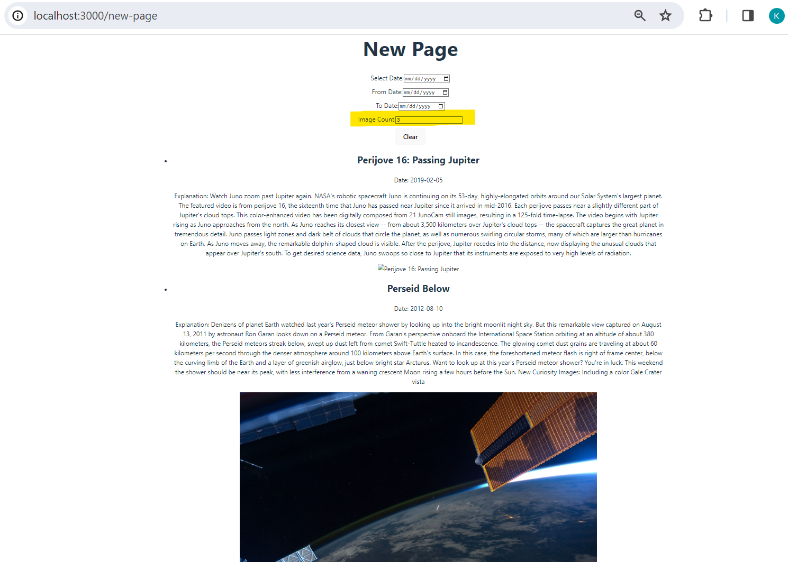


- Clear button to reset all input fields.

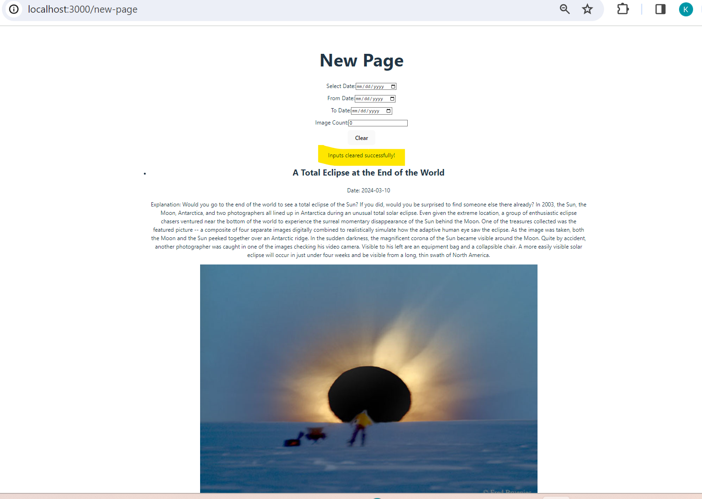


- Ensuring selected date is today's date or a previous date. If a future date is selected, it displays a message

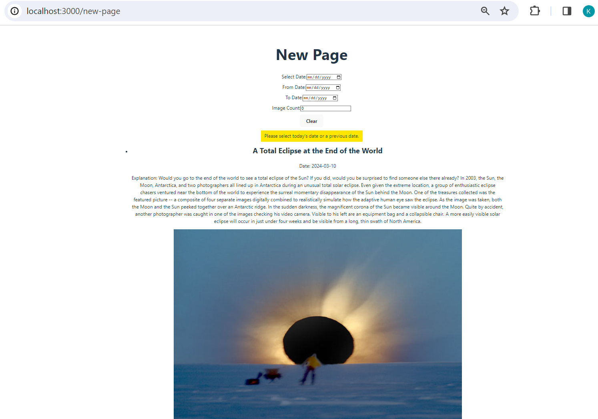

 
- Feedback messages for various actions.

**Note:** When accessing the `/new-page` route (http://localhost:3000/new-page), it will automatically fetch and display today's information. Subsequent interactions, such as entering a start date, end date, or count, will update the displayed information accordingly. Clicking the "Clear" button will reset the inputs and display today's information again.

The React frontend communicates with the Spring Boot backend through API calls, enabling seamless integration between the backend and the user interface.

4. Routes

The app has multiple routes for navigation:

- `/`: Home page with XKCD comics (previous functionality).
- `/new-page`: New page for NASA API connections.

5. Features
- React Router Integration: Utilizes react-router-dom for navigation.
- Outlet Usage: Maintains a consistent navigation structure.
- Input Fields:
	- Select Date
	- From Date
	- To Date
	- Image Count
- NASA API Connections:
	- Fetches data based on selected date, date range, and image count.
	- Maps through responses to display information.
- Validation:
	- Ensures selected date is today's date or a previous date.
	- Displays a message for future date selections.
- Clear Button Feedback: Provides feedback when the "Clear" button is clicked.


===========================================

# Assignment1:

# Nasa Api APOD Spring API Project

## Project Repository
The source code for this project is hosted on GitHub. You can find it [here](https://github.com/komalivikas/WebEng_Assignment1_Nasa).

## Introduction: ##

The Nasa Api APOD Spring API Project is a Spring Boot application designed to interact with NASA's Astronomy Picture of the Day (APOD) API. It serves as a versatile tool for fetching and displaying space-related content, offering a range of features to cater to different user needs.


## Key Features: ##


- Flexible Query Parameters: The API supports various query parameters such as date, start date, end date, count, high-definition content retrieval (hd), and inclusion of thumbnail URLs for videos (thumbs).
- Ease of Integration: The project is built on Spring Boot, providing a robust and easily extensible framework for integrating with NASA's APOD API.
- Detailed Endpoint Documentation: The README includes a comprehensive guide to the available endpoints, complete with examples and screenshots.

## Project Structure: ##

NasaController: This class contains the endpoint mappings for interacting with the NASA APOD API. It handles incoming requests and communicates with the NasaService to fetch data.

NasaService: The service class is responsible for interacting with the NASA APOD API. It utilizes a RestTemplate to make HTTP requests and handles the logic for parsing and processing API responses.

## NASA API Endpoint: ##

The project includes endpoint to retrieve information from NASA's Astronomy Picture of the Day (APOD) API.

**Parameters:**
- `date` 		: The date for which we want the APOD. Format: YYYY-MM-DD.
- `startDate`	: Start date for fetching content in the format YYYY-MM-DD.
- `endDate`		: End date for fetching content in the format YYYY-MM-DD.
- `count`		: Number of entries to fetch. If not specified, defaults to 1.
- `hd`			: Specify true to retrieve high-definition content.
- `thumbs`		: Specify true to include thumbnail URLs for videos.

**Endpoint:**

Method: GET

- **Fetch the latest space-related content:**
http://localhost:8080/nasa/apod
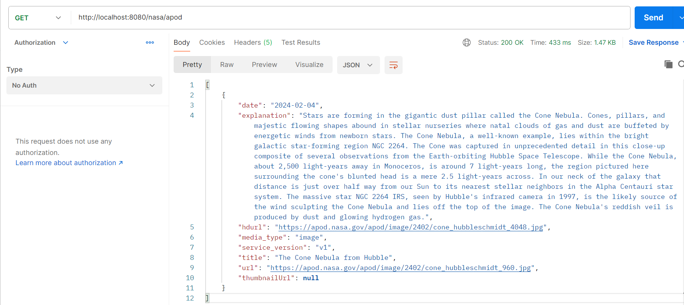


- **Fetch content for a specific date:**
http://localhost:8080/nasa/apod?date=2024-02-04
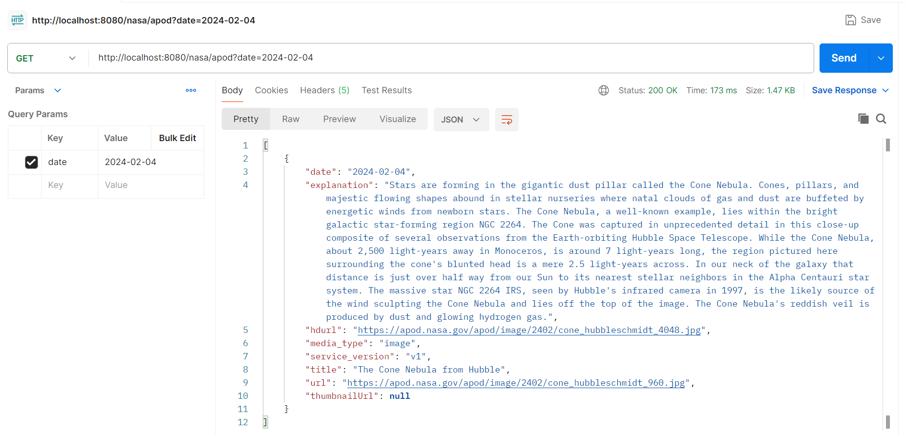


- **Fetch content for multiple entries/ Range of dates:**
http://localhost:8080/nasa/apod?start_date=2024-02-01&end_date=2024-02-03
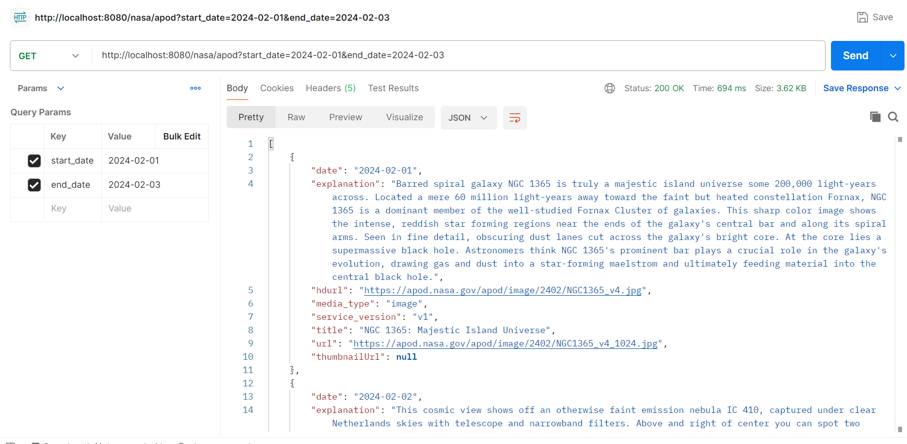


- **Fetch content for multiple entries for a given Count**
http://localhost:8080/nasa/apod?count=4
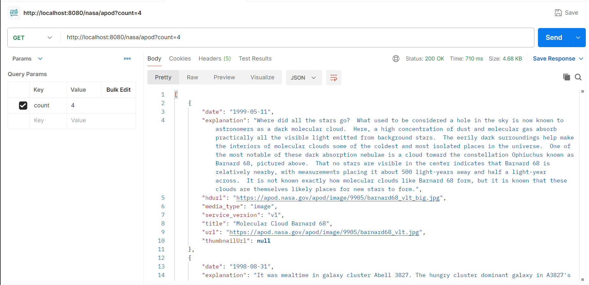


- **Fetch content for multiple entries with HD images:**
http://localhost:8080/nasa/apod?start_date=2024-01-04&end_date=2024-02-03&hd=true
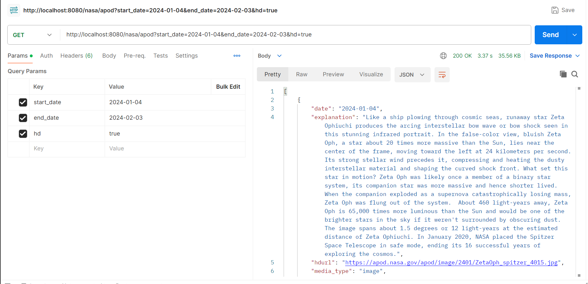


- **Fetch content for a specific date with thumbnails:**
http://localhost:8080/nasa/apod?date=2024-01-10&thumbs=true
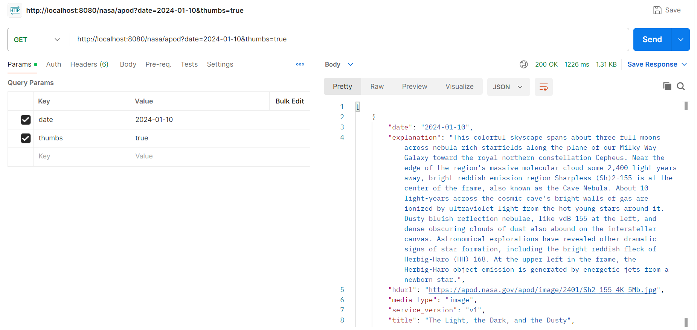
